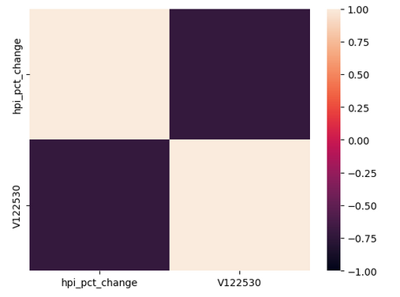

# Ontario Housing Market Analysis
Project 1 for Fintech Bootcamp

1. What are the trends for Ontario real estate for 2005-2023?

2. How do interest rates affect the housing market in Ontario?

3. Where is the housing market trending? 

